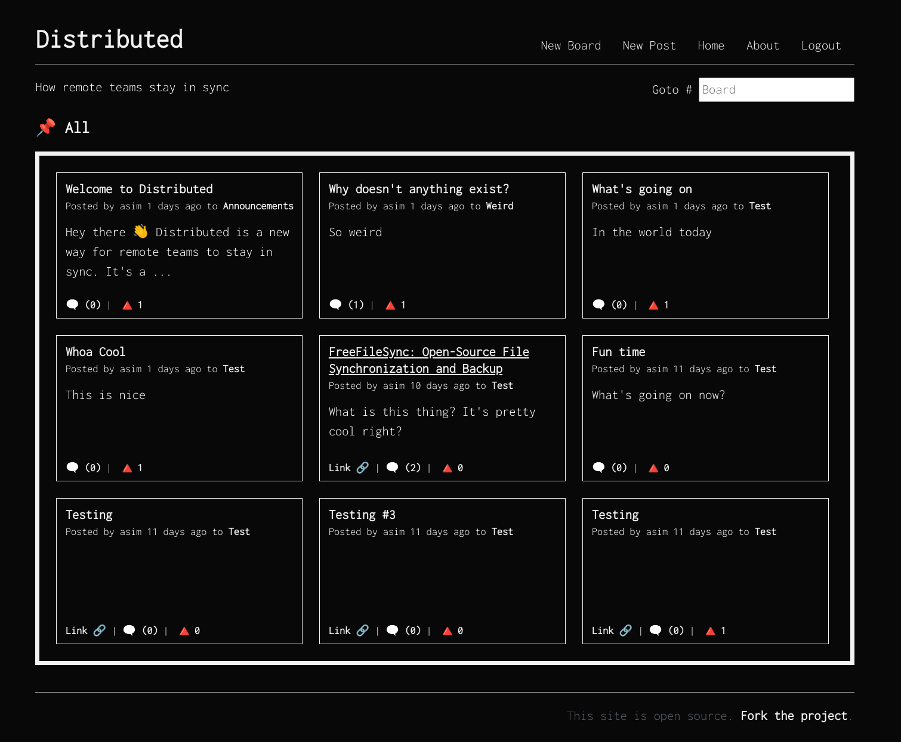

# Distributed

How remote teams stay in sync

## Overview

Build a knowledge base, ask questions and stay in sync with your team all while doing it asynchronously.
Distributed is a building block for remote teams and communities. Write posts, leave comments and 
upvote the most relevant content.



## Source

Find the source code on [GitHub](https://github.com/godistributed/distributed).

## Usage

Distributed is built as a Go server with embedded html and 
backed by APIs on [M3O](https://m3o.com).

### API Key

Get an API key from [m3o.com](https://m3o.com/) and export as

```sh
export M3O_API_TOKEN=xxxxxx
```

### Server

Download and install

```sh
go get godistributed.org/cmd/distributed
```

Run the server

```sh
distributed
```

Your app should be running on `localhost:8080`

## Development

For local development clone the project 

```
git clone https://github.com/godistributed/distributed
```

- Edit frontend html/js/css in distributed/html/
- Edit backend APIs in distributed/distributed.go

Run the app

```
go run distributed/cmd/distributed
```
